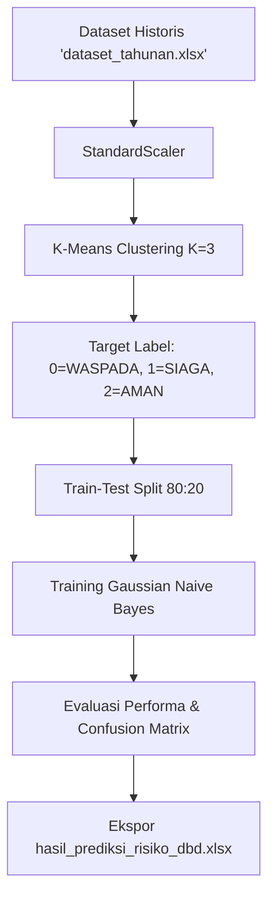

# 🔬 Panduan Teknis Pelatihan Model AI: `README_TRAINING.md`

Berkas ini menjelaskan secara mendalam tentang arsitektur model AI Hybrid yang digunakan dalam berkas `root/training_model.py`. Dokumen ini dirancang untuk memudahkan Anda memahami alur kerja, rumus matematika, serta memberikan referensi teoretis yang sangat kuat untuk penyusunan makalah/esai kompetisi.

---

## 🧭 Ringkasan Arsitektur Model AI Hybrid

Model AI yang dibangun menggunakan pendekatan **Hybrid Unsupervised-Supervised Learning**, yang menggabungkan dua algoritma utama:
1. **K-Means Clustering** (Unsupervised): Bertugas membuat zonasi/klasterisasi tingkat risiko (Aman, Waspada, Siaga) secara objektif dari data historis tahunan Kalimantan Barat.
2. **Gaussian Naive Bayes** (Supervised): Bertugas mempelajari pola klaster dari data historis tersebut, lalu bertindak sebagai mesin klasifikasi probabilitas secara real-time pada dashboard web.

---

## 🛠️ Langkah demi Langkah & Penjelasan Algoritma

### 1. Standardisasi Fitur (`StandardScaler`)
Sebelum data diproses oleh model AI, semua fitur lingkungan disamakan skalanya.

* **Alasan Penggunaan:** Fitur **Kepadatan Penduduk** memiliki skala angka ratusan hingga ribuan (misal: 10 s/d 5.000 jiwa/km²), sedangkan **Suhu Udara** berada pada rentang puluhan (25°C s/d 28°C). Jika tidak disamakan skalanya, algoritma AI akan menganggap fitur Kepadatan jauh lebih penting secara matematis hanya karena angkanya lebih besar.
* **Rumus Matematika (Z-Score Normalization):**
  $$z = \frac{x - \mu}{\sigma}$$
  *Di mana:*
  * $z$ = Nilai fitur setelah distandardisasi.
  * $x$ = Nilai fitur asli.
  * $\mu$ = Rata-rata (*mean*) dari fitur tersebut.
  * $\sigma$ = Standar deviasi (*standard deviation*) dari fitur tersebut.

---

### 2. Tahap 1: K-Means Clustering (Zonasi Risiko Objektif)
* **Alasan Penggunaan:** Data historis yang kita miliki tidak menyertakan label kategori risiko (tidak tertulis mana wilayah Aman, Waspada, atau Siaga). K-Means digunakan untuk mengelompokkan data ke dalam 3 klaster secara otomatis berdasarkan kemiripan pola data cuaca dan kasus DBD.
* **Cara Kerja:** Algoritma ini menentukan 3 titik pusat (*centroid*) acak, mengukur jarak setiap data ke *centroid* terdekat, lalu memperbarui posisi *centroid* secara berulang-ulang (*iterative*) hingga posisi klaster stabil.
* **Rumus Jarak (Euclidean Distance):**
  Jarak antara suatu data ($p$) dengan pusat klaster ($q$) dihitung menggunakan rumus:
  $$d(p, q) = \sqrt{\sum_{i=1}^n (p_i - q_i)^2}$$
* **Fungsi Objektif (Sum of Squared Errors - SSE):**
  K-Means bertujuan meminimalkan total kuadrat jarak seluruh data ke pusat klasternya masing-masing:
  $$J = \sum_{j=1}^{k} \sum_{i=1}^{n} \|x_i^{(j)} - c_j\|^2$$
  *Di mana $c_j$ adalah pusat klaster ke-$j$, dan $x_i$ adalah data ke-$i$ di dalam klaster tersebut.*

---

### 3. Pembagian Data Latih dan Data Uji (Train-Test Split 80:20)
* **Alasan Penggunaan:** Untuk menguji kehebatan model secara ilmiah sebelum di-deploy, data dibagi menjadi **80% untuk latihan** (`X_train`, `y_train`) dan **20% untuk ujian** (`X_test`, `y_test`).
* **Metode Stratified:** Kita menggunakan `stratify=y` agar proporsi sebaran kelas Aman, Waspada, dan Siaga pada data latihan dan data uji tetap seimbang, sehingga evaluasi model tidak bias.

---

### 4. Tahap 2: Gaussian Naive Bayes (Klasifikasi Probabilitas)
* **Alasan Penggunaan:** 
  1. **Cocok untuk Dataset Kecil:** Naive Bayes sangat efisien dan tidak membutuhkan data latihan berskala jutaan baris untuk menjadi pintar.
  2. **Menghasilkan Nilai Probabilitas:** Naive Bayes secara alami menghasilkan probabilitas kelas (`predict_proba`). Nilai ini sangat krusial untuk menghitung **Drift Risk** (laju pergeseran risiko) dan memicu sistem **Golden Window Alert** jika peluang naik tingkat bahaya > 50%.
* **Penjelasan Teoretis:** Algoritma ini memprediksi kelas berdasarkan Teorema Bayes dengan asumsi bahwa setiap fitur bersifat saling bebas (*naive/independent*).
* **Rumus Teorema Bayes:**
  $$P(y \mid X) = \frac{P(X \mid y) \cdot P(y)}{P(X)}$$
  *Di mana:*
  * $P(y \mid X)$ = Peluang wilayah masuk ke kelas $y$ (Aman/Waspada/Siaga) setelah melihat kondisi cuaca $X$.
  * $P(X \mid y)$ = Peluang kondisi cuaca $X$ terjadi pada kelas $y$ (dihitung dari data historis).
  * $P(y)$ = Peluang dasar terjadinya kelas $y$ (prior probability).
  * $P(X)$ = Peluang terjadinya kondisi cuaca $X$ secara keseluruhan.

* **Mengapa Disebut "Gaussian"? (Gaussian Probability Density Function):**
  Karena fitur cuaca dan kepadatan bersifat kontinu (berupa angka pecahan, bukan ya/tidak), peluang terjadinya suatu fitur $x$ pada kelas $y$ dihitung menggunakan kurva lonceng normal (Gaussian):
  $$P(x_i \mid y) = \frac{1}{\sqrt{2\pi\sigma_y^2}} e^{-\frac{(x_i - \mu_y)^2}{2\sigma_y^2}}$$
  *Di mana:*
  * $\mu_y$ = Rata-rata fitur $x_i$ pada kelas $y$.
  * $\sigma_y^2$ = Variansi fitur $x_i$ pada kelas $y$.

---

## 📊 Evaluasi Performa Model

Setelah dilatih, model diuji pada data uji (20% data sisa) dan kinerjanya dievaluasi menggunakan dua metrik penting:
1. **Confusion Matrix:** Tabel yang menyajikan jumlah tebakan benar dan tebakan salah untuk masing-masing kategori Aman, Waspada, dan Siaga.
2. **Classification Report (Akurasi, Precision, Recall, F1-Score):**
   * **Precision:** Menilai ketepatan prediksi AI (apakah wilayah yang ditebak "Siaga" memang benar-benar bahaya).
   * **Recall:** Menilai sensitivitas AI (seberapa banyak kasus bahaya riil yang berhasil dideteksi oleh AI).
   * **F1-Score:** Nilai rata-rata harmonis antara Precision dan Recall.

---

## 💡 Mengapa Arsitektur Hybrid Ini Sangat Kuat Untuk Lomba?

1. **Objektivitas Tinggi (Tanpa Asumsi Manual):** Penggunaan K-Means membuat penentuan label Aman/Waspada/Siaga didasarkan murni pada klasterisasi data statistik lingkungan Kalbar, bukan tebakan subjektif manusia.
2. **Kecepatan Proses:** Proses komputasi latihan model sangat cepat (kurang dari 0,5 detik), sehingga model dapat melakukan *retraining* kilat di memori setiap kali data baru diperbarui.
3. **Fitur Mitigasi Cerdas:** Dikombinasikan dengan sistem pembatas cerdas `np.clip` (penjelasannya ada di `README_NP_CLIP.md`), arsitektur ini terbukti tangguh dari anomali cuaca ekstrem dunia nyata.
